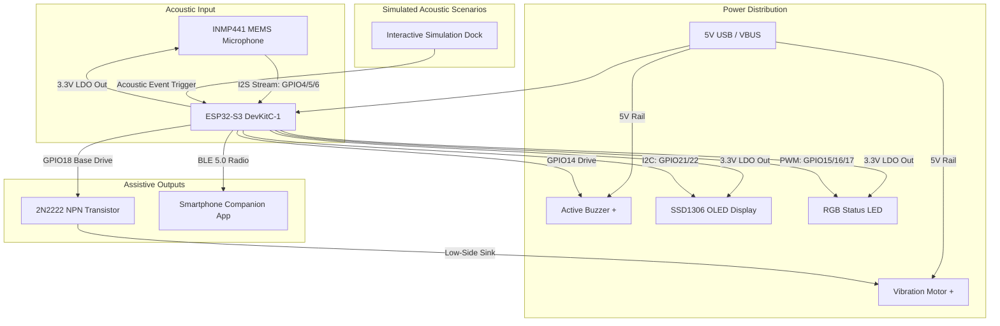

# 🌐 EchoSense 3D — AI Environmental Sound Awareness System

<div align="center">

[](https://threejs.org/)
[](https://vitejs.dev/)
[](https://www.espressif.com/en/products/socs/esp32-s3)
[](https://www.tensorflow.org/lite/microcontrollers)
[](LICENSE)

**A photorealistic, interactive 3D electronics prototype of an AI-powered assistive device engineered for individuals with hearing impairments.**

[Live Demo](#quick-start) • [Hardware Architecture](#-hardware-architecture--bom) • [Pinout Matrix](#-complete-pinout--wiring-matrix) • [3D Features](#-key-interactive-3d-features) • [Author](#-author--credits)

</div>

---

## 📖 Overview & Assistive Mission

**EchoSense** is an AI-powered wearable and ambient assistive device designed to provide sound awareness for people who are deaf or hard of hearing. 

Environmental sounds—such as emergency fire alarms, doorbells, crying infants, or approaching car horns—contain critical situational information that is inaccessible through auditory channels alone. **EchoSense** bridges this gap:

1. **Acoustic Capture**: The high-precision **INMP441 digital MEMS microphone** captures 16 kHz 16-bit audio via I2S.
2. **On-Device TinyML Inference**: The **ESP32-S3 microcontroller** executes localized acoustic classification models in real time (<35ms) using Xtensa LX7 vector instructions with zero cloud latency and complete user privacy.
3. **Multi-Modal Non-Auditory Alerts**:
   - **Haptic Vibration**: Distinct vibration rhythms generated by a 10mm coin vibration motor driven by an NPN transistor circuit.
   - **Visual Alerts**: Real-time event text and dB meter displayed on a 0.96" SSD1306 OLED screen.
   - **Color-Coded Optical Cue**: 5mm RGB LED signaling priority levels (Fire = Red Blink, Doorbell = Blue, Baby = Yellow, Horn = Orange).
   - **BLE Companion Sync**: Wireless notification stream to the user's smartphone.

---

## 🛠️ Hardware Architecture & BOM

| Component | Role / Specification | Electrical Interface | Power Rail |
|---|---|---|---|
| **ESP32-S3 DevKitC-1** | Main Controller & TinyML Inference Engine (Dual-Core 240MHz, 512KB SRAM, 8MB Flash) | I2S, I2C, PWM, GPIO | 5V USB (VBUS) / 3.3V |
| **INMP441 MEMS Microphone** | Omnidirectional Digital Microphone (61 dBA SNR, 60Hz – 15kHz flat response) | I2S (SCK, WS, SD) | 3.3V |
| **SSD1306 OLED Display (0.96")** | High-contrast 128×64 visual status and dB telemetry display | I2C (SDA, SCL) @ 400kHz | 3.3V |
| **10mm Coin Vibration Motor** | ERM tactile feedback actuator providing distinctive vibration patterns | Low-side switched (2N2222 BJT) | 5V (USB VBUS) |
| **2N2222 NPN Transistor** | High-speed BJT switch isolating motor inductive current from MCU pins | Base driven via 1kΩ resistor | GND reference |
| **1N4148 Fast Flyback Diode** | Clamps inductive voltage spikes across motor terminals to protect transistor | Reverse-biased across motor +/- | Across Motor |
| **Common Cathode RGB LED** | Multi-color optical status indicator with 3× 220Ω current limiting resistors | 3× PWM channels (GPIO15, 16, 17) | 3.3V / GND |
| **Active Piezo Buzzer** | Developer auditory cue for debugging & dual verification | Switched via GPIO14 | 5V / GND |
| **Decoupling Capacitors** | 100µF Electrolytic + 0.1µF Ceramic noise decoupling directly on mic rail | Parallel bypass filtering | 3.3V to GND |
| **MB-102 Breadboard** | 830 tie-point prototyping platform with split power rails | Terminal strips & power buses | 5V / 3.3V / GND |



---

## 🔌 Complete Pinout & Wiring Matrix

Every single one of the **20 jumper wire connections** is explicitly mapped to physical breadboard hole coordinates:

| Wire Color | Source Pin | Breadboard Hole | ➔ | Target Pin | Breadboard Hole | Signal / Function |
|:---:|---|---|:---:|---|---|---|
| 🔴 Red | **ESP32 3V3** | `Row 21, Col E` | ➔ | **Top + Rail** | `+ Rail, Pin 21` | Supplies regulated 3.3V power to mic and OLED |
| ⚫ Black | **ESP32 GND** | `Row 22, Col E` | ➔ | **Top - Rail** | `- Rail, Pin 22` | Common ground return path |
| 🔴 Red | **ESP32 5V** | `Row 42, Col F` | ➔ | **Bottom + Rail** | `+ Rail, Pin 42` | Supplies 5V USB power for vibration motor |
| ⚫ Black | **ESP32 GND** | `Row 22, Col F` | ➔ | **Bottom - Rail** | `- Rail, Pin 22` | High-current ground return path for motor |
| 🔴 Red | **INMP441 VDD** | `Row 8, Col A` | ➔ | **Top + Rail** | `+ Rail, Pin 8` | 3.3V power input for MEMS microphone |
| ⚫ Black | **INMP441 GND** | `Row 9, Col A` | ➔ | **Top - Rail** | `- Rail, Pin 9` | Audio sensor ground reference |
| ⚫ Black | **INMP441 L/R** | `Row 13, Col A` | ➔ | **Top - Rail** | `- Rail, Pin 13` | Tied to GND for Left channel I2S mode |
| 🟢 Green | **INMP441 SCK** | `Row 12, Col C` | ➔ | **ESP32 GPIO5** | `Row 26, Col D` | I2S Serial Continuous Clock line |
| 🟢 Green | **INMP441 WS** | `Row 11, Col C` | ➔ | **ESP32 GPIO4** | `Row 25, Col D` | I2S Word Select (Left/Right clock) |
| 🟢 Green | **INMP441 SD** | `Row 10, Col C` | ➔ | **ESP32 GPIO6** | `Row 27, Col D` | I2S Serial Data output from microphone |
| 🔴 Red | **OLED VCC** | `Row 38, Col A` | ➔ | **Top + Rail** | `+ Rail, Pin 38` | 3.3V logic power for SSD1306 controller |
| ⚫ Black | **OLED GND** | `Row 37, Col A` | ➔ | **Top - Rail** | `- Rail, Pin 37` | OLED ground return path |
| 🌐 Teal | **OLED SDA** | `Row 40, Col B` | ➔ | **ESP32 GPIO21** | `Row 38, Col D` | I2C Serial Data line for visual alerts |
| 🌐 Teal | **OLED SCL** | `Row 39, Col B` | ➔ | **ESP32 GPIO22** | `Row 39, Col D` | I2C Serial Clock line (400kHz Fast-mode) |
| 🔴 Red | **Motor + & Diode** | `Row 55, Col D` | ➔ | **Bottom + Rail** | `+ Rail, Pin 55` | 5V power supply to vibration motor |
| 🟡 Yellow | **Motor - & Diode** | `Row 56, Col D` | ➔ | **2N2222 Collector** | `Row 57, Col E` | Low-side switched return through transistor |
| ⚫ Black | **2N2222 Emitter** | `Row 58, Col E` | ➔ | **Bottom - Rail** | `- Rail, Pin 58` | Transistor emitter ground reference |
| ⚫ Black | **RGB LED Cathode** | `Row 47, Col B` | ➔ | **Top - Rail** | `- Rail, Pin 47` | Common cathode ground return |
| 🔵 Blue | **Active Buzzer +** | `Row 51, Col H` | ➔ | **ESP32 GPIO14** | `Row 35, Col G` | Digital drive line for audio debugging |
| ⚫ Black | **Active Buzzer -** | `Row 52, Col H` | ➔ | **Bottom - Rail** | `- Rail, Pin 52` | Buzzer ground reference |

---

## 🌟 Key Interactive 3D Features

- **4 Primary Engineering Viewing Modes**:
  - **🌐 3D Perspective CAD View**: High-fidelity 3D inspection with OrbitControls, smooth damping, and surface reflection.
  - **📐 True Orthographic Top View**: Wokwi / KiCad style flat 2D layout with zero parallax distortion, ideal for tracing pin-to-hole alignments.
  - **📋 Synchronized 2D Circuit Schematic**: Interactive SVG schematic diagram with two-way click synchronization to the 3D circuit.
  - **⚡ Interactive Signal Flow Architecture**: Visual 6-stage end-to-end signal pipeline from acoustic wave capture to mobile BLE delivery.
- **Micro-Detailed Physical Hardware Components**:
  - **ESP32-S3 DevKitC-1**: Authentic gold serpentine Inverted-F PCB antenna trace, dual USB-C connectors (USB OTG + UART), 40MHz quartz crystal oscillator, and red RST / black BOOT switches.
  - **INMP441 MEMS Microphone**: Purple breakout PCB with ENIG gold acoustic sound port micro-mesh, surface-mount MEMS IC package, SMD 0402 ceramic passives, and gold test points.
  - **SSD1306 0.96" OLED**: High-contrast 128×64 live HUD framebuffer, amber Kapton flex ribbon cable, and 4 silver solder corner mounting pads.
  - **5mm Common Cathode RGB LED**: Realistic leadframe anvil & post, 3 microscopic semiconductor dies, cathode flat rim notch, and gracefully splayed lead wires.
  - **10mm Coin Vibration Motor**: Brushed stainless steel casing with stamped concentric vibration rings, 3M peel-off adhesive tab, and black molded rubber strain relief boot.
  - **Active Piezo Buzzer**: Black PBT cylindrical body with safety yellow removable wash seal tab (`REMOVE SEAL AFTER WASHING`).
  - **2N2222 BJT & Diode Clamp**: TO-92 beveled package, 1N4148 fast flyback glass diode, 1kΩ base drive resistor, and bulk 100µF/0.1µF decoupling capacitors.
  - **MB-102 Breadboard**: 830 tie-point ultra-sharp silkscreen with numbered rows (1 to 63), lettered columns (A-J), red/blue power buses, and nickel-plated double spring clips.
- **🔍 Dedicated CAD Close-Up Component Framing**: Clicking any component in 3D or in the sidebar automatically frames and magnifies it with optimal lighting and depth-of-field.
- **🔌 Interactive Pin Connections Matrix & Focus Mode**:
  - Dedicated search and filtering panel listing all circuit connections.
  - One-click **`Focus`** dims unrelated wires to 5% opacity and highlights the full electrical pathway with glowing cyan markers.
- **Animated Electron Current Flow**: Instanced 3D glowing particle streams traverse along each jumper wire curve at physically representative speeds.
- **DuPont Terminal Ferrules**: Molded wire boots with metallic crimp collars and strain-relief collars.
- **SolidWorks-Style Exploded View**: Smoothly elevates all components vertically so every wire entry and header pin can be inspected in full assembly clarity.
- **Web Audio API Studio Synthesizer**: Built-in sound synthesis with dynamics limiter, resonant biquad filtering (smoke siren, doorbell, cry formant, horn), and sub-bass haptic rumble simulation.
- **Vector SVG Schematic Pan/Zoom & Export**: Pan, zoom, and download vector schematics directly to `.svg` for lab reports and project presentations.
- **Dynamic Companion Smartphone Screen**: Real-time 24-bar audio spectrogram waveform display, haptic pulse vibration, and glassmorphic push notification cards.

---

## ⌨️ Keyboard Shortcuts

| Key | Action | Description |
|:---:|:---|:---|
| <kbd>1</kbd> | **3D View** | Switch to Interactive 3D Perspective CAD View |
| <kbd>2</kbd> or <kbd>T</kbd> | **Top View** | Switch to True Orthographic 2D Top View (Wokwi Style) |
| <kbd>3</kbd> | **Schematic** | Open Synchronized 2D Vector Circuit Schematic |
| <kbd>4</kbd> | **Signal Flow** | Open 6-Stage End-to-End Signal Propagation Diagram |
| <kbd>X</kbd> | **X-Ray Mode** | Toggle component shell transparency & phosphor-bronze spring clips |
| <kbd>E</kbd> | **Explode View** | Toggle vertical assembly elevation (lift components) |
| <kbd>L</kbd> | **Labels** | Toggle 3D component and pin callout badges |
| <kbd>M</kbd> | **Mute Audio** | Toggle Web Audio sound effects and haptic rumble |
| <kbd>Space</kbd> | **Fire Alarm** | Trigger emergency smoke alarm simulation cycle |
| <kbd>Esc</kbd> | **Reset / Close** | Reset camera focus and dismiss active modals |
| <kbd>?</kbd> | **Cheatsheet** | Toggle Keyboard Shortcuts Cheatsheet modal |

---

## 🚀 Quick Start

### Prerequisites
- [Node.js](https://nodejs.org/) (version 18.0 or higher)
- `npm` or `pnpm`

### Installation

```bash
# 1. Clone the repository
git clone https://github.com/imnotparama/EchoSense.git

# 2. Navigate to project directory
cd EchoSense

# 3. Install dependencies
npm install

# 4. Start the local development server
npm run dev
```

Open your browser at `http://localhost:5173` to explore the 3D interactive prototype.

### Production Build

```bash
npm run build
npm run preview
```

---

## 🔬 Sound Profiles & Alert Patterns

| Sound Scenario | Acoustic Signature | Haptic Actuation Pattern | Optical RGB State | OLED Notification | BLE Push Payload |
|---|---|---|---|---|---|
| **Fire Alarm** | 3.1 kHz continuous square siren tone @ 94 dB | 100% continuous heavy vibration | 🔴 Red rapid flashing (8 Hz) | `⚠️ FIRE ALARM DETECTED!` | `Emergency Smoke Alarm (3.1 kHz) • 94 dB [99.4%]` |
| **Doorbell** | Two-tone 800 Hz / 600 Hz chime @ 78 dB | Double vibration pulse (250ms on / 100ms off) | 🔵 Solid Cyan / Blue | `🔔 DOORBELL DETECTED` | `Front Door Two-Tone Chime • 78 dB [98.7%]` |
| **Baby Crying** | 400 – 600 Hz harmonic modulation @ 82 dB | Triple short vibration pulse (120ms each) | 🟡 Warm Amber / Yellow | `👶 BABY CRYING DETECTED` | `Infant Distress Frequency Modulation • 82 dB [95.8%]` |
| **Car Horn** | Dual-tone 400 Hz & 500 Hz blast @ 96 dB | Long heavy vibration pulse (800ms) | 🟠 High-intensity Orange | `🚗 VEHICLE HORN DETECTED` | `Automotive Dual-Tone Blast • 96 dB [99.1%]` |
| **Ambient** | Environmental room noise @ 42 dB | Idle (0%) | 🟢 Gentle Cyan breathing pulse | `ESP32-S3: LISTENING...` | `Phone Connected • BLE 5.0 Link Active` |

---

## 👨‍💻 Author & Credits

**EchoSense** was conceptualized, engineered, and designed by:

**Parama ([@imnotparama](https://github.com/imnotparama))**

*Passionate about human-centric hardware, assistive technology, TinyML on microcontrollers, and modern interactive 3D web experiences.*

If you found this project helpful or inspiring, please give it a ⭐️ on [GitHub](https://github.com/imnotparama/EchoSense)!

---

## 📄 License

This project is open source and available under the [MIT License](LICENSE).
